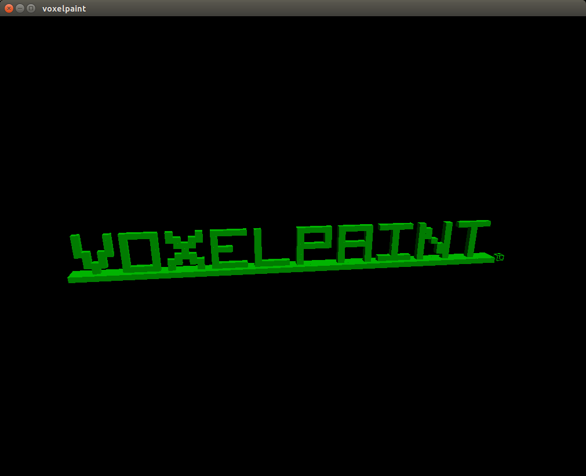
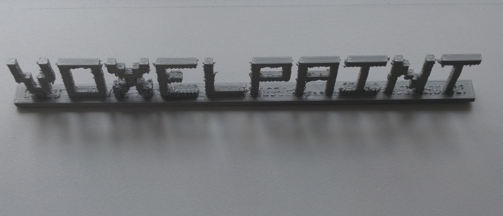
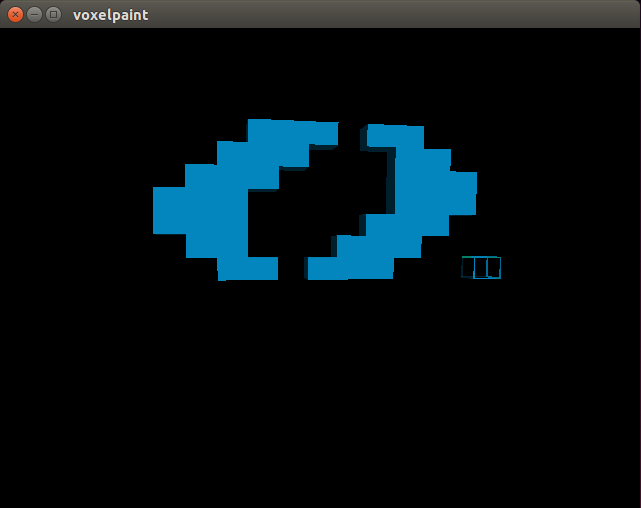

## Voxelpaint

Voxelpaint is a three-dimensional version of Microsoft Paint built using C++ and OpenGL. Authors: [@joeylmaalouf](http://github.com/joeylmaalouf), [@jovanduy](http://github.com/jovanduy), [@jsutker](http://github.com/jsutker), [@sarahwalters](http://github.com/sarahwalters)

OpenGL is the most widely used and supported 2D and 3D graphics API. It abstracts away the lowest-level graphics primitives and provides wrapper functions which make it easier to model, render, and manipulate three-dimensional objects. We chose to use OpenGL because we preferred to focus on the project-specific details than a low-level implementation.

C++ is one of the programming languages most commonly used with OpenGL.

### Implementation

Voxelpaint’s drawing mechanism is a cursor which the user can move through the world using the arrow keys and page up / page down. Placing the cursor (space bar) creates voxels in the shape of the cursor; erasing the cursor (backspace) deletes voxels in the shape of the cursor. Pressing “c” lets the user set the color of the cursor, which determines the color of the voxels it places. The cursor’s size can be increased with “=” and decreased with “-”. There are currently two different brush shapes to choose from: spherical (“1”) and cubic (“2”). We considered a purely mouse-based voxel placing and erasing interface, but we settled on a cursor-based interface because we couldn’t think of a clean way to transform two-dimensional mouse position into three-dimensional world position.

Voxels are stored in the Voxelpaint world in a “grid”. The grid is represented by a hashmap from position to voxel object. The only operations we need to perform on the grid are “insert voxel at position” and “delete voxel at position”; we chose a hashmap so both of those operations would have O(1) time complexity.

Voxelpaint has the capability to export to and import from a custom file format (we’ve called this format “3dp”, which stands for “3D pixels”). Additionally, it can export to STL. It cannot import from STL -- STL is triangle-facet-based, and it’s easy to convert voxels into triangle facets but difficult to convert triangle facets back into voxels.

Additionally, Voxelpaint has undo (“u”) and redo (ctrl + “u”) capability for the complete history of each model, as well as zooming (“z” and “x”) and rotating (“w”, “s”, “a”, “d”, “q”, “e”) camera controls.

### Results

We have used Voxelpaint to model a logo, exported it to STL, and 3D-printed it using one of the printers in the library.

We also modeled the Olin O, for fun.

### Annotated Bibliography

[General introductory reference on OpenGL](http://www.glprogramming.com/red/chapter01.html) This tutorial describes OpenGL’s capabilities, gives a high-level overview of its rendering pipeline, points to common libraries, and explains double-buffered animation.

[Tutorial for rotation in a plane](http://www.lighthouse3d.com/tutorials/glut-tutorial/mouse-putting-it-all-together/) This tutorial provides an example of triggering events upon mouse click / mouse motion in OpenGL and describes how to set up ground plane rotation upon mouse drag.

[C++ tutorials point](https://www.tutorialspoint.com/cplusplus/) This website has a lot of examples and documentation for many C++ functions. Anytime we need to look up a C++-specific function or syntax, this is our go-to resource.
